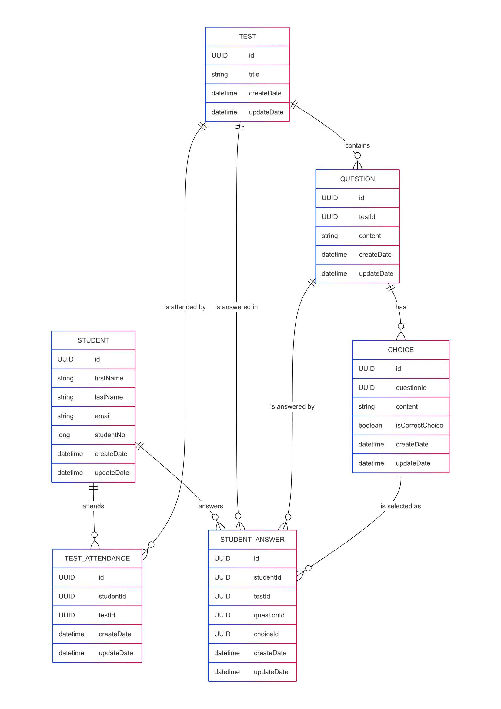

# DopingCase Backend API

This project provides a backend system for managing student test operations including test creation, attendance, answering, and reporting. It's designed for scenarios like educational assessments or exam systems where students can participate in multiple-choice tests and track their performance.

---

## Data Model

The project uses a relational data model designed with entities like `Student`, `Test`, `Question`, `Choice`, `StudentAnswer`, and `TestAttendance`.



---

## Technologies Used

- **Java 21 + Spring Boot 3** — Backend framework
- **H2** — In-memory / relational database
- **Hibernate & Spring Data JPA** — ORM and repository abstraction
- **Redis** — Used for caching (student reports, test data)
- **Spring Cache** — Redis integration with caching abstraction
- **Liquibase** — Database migration and schema management
- **Docker & Docker Compose** — Containerized deployment
- **Lombok** — Reduces boilerplate code
- **Postman** — For testing API endpoints

---

## Endpoints

### Student

| Method | Endpoint                | Description            |
|--------|-------------------------|------------------------|
| POST   | `/student`              | Create a student       |
| GET    | `/student`              | List all students      |
| GET    | `/student/{id}`         | Get student by ID      |
| PUT    | `/student/{id}`         | Update student         |
| DELETE | `/student/{id}`         | Delete student         |

---

### Test

| Method | Endpoint                | Description                  |
|--------|-------------------------|------------------------------|
| POST   | `/test`                 | Create a test with questions |
| GET    | `/test`                 | Get all tests (paged)        |
| GET    | `/test/meta`           | Get metadata of tests        |
| GET    | `/test/{id}`            | Get test by ID               |
| PUT    | `/test/{id}`            | Update a test                |
| DELETE | `/test/{id}`            | Delete a test                |

#### Sample Request Body (Create/Update Test)
```json
{
  "title": "Sample Test",
  "questions": [
    {
      "content": "What is JVM?",
      "choices": [
        { "content": "Java Virtual Machine", "isCorrectChoice": true },
        { "content": "Java Vendor Method", "isCorrectChoice": false }
      ]
    }
  ]
}
```

---

### Test Attendance

| Method | Endpoint                | Description            |
|--------|-------------------------|------------------------|
| POST   | `/test/attend`          | Student attends a test |
| DELETE | `/test/attend`          | Remove attendance      |

### Student Answer

| Method | Endpoint                 | Description               |
|--------|--------------------------|---------------------------|
| POST   | `/answer/submit`         | Submit an answer          |
| PUT    | `/answer/change`         | Change an answer          |

---

### Student Report

| Method | Endpoint                      | Description              |
|--------|-------------------------------|--------------------------|
| GET    | `/report/{studentId}`         | Get test performance report for student |

---

## Postman Collection

Use the provided [Postman Collection](DopingCase API Tests.postman_collection.json) for testing all endpoints easily.

---

## Installation & Run

Make sure Docker is installed. Then simply run:

```bash
docker-compose up
```

This will start the application and its Redis dependency.
